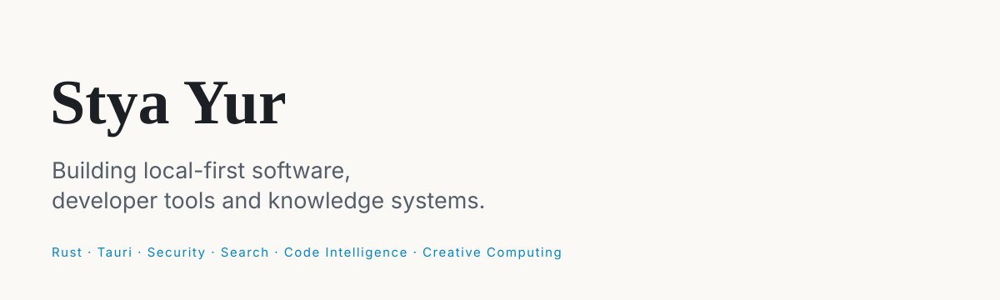

  

  <picture>
    <source media="(prefers-color-scheme: dark)" srcset="assets/brand/hero-dark.svg" />
    <source media="(prefers-color-scheme: light)" srcset="assets/brand/hero-light.svg" />
    
  </picture>

  <a href="https://styayur.co.uk">Portfolio</a> &nbsp;·&nbsp;
  <a href="https://github.com/styayur">GitHub</a> &nbsp;·&nbsp;
  <a href="https://discord.gg/wA2xy6VPK">Discord</a>

## Featured Work

<table align="center">
  <tr>
    <td align="center" width="50%">
       
      <strong>Developer Security Workspace</strong> 
      Local-first SARIF vulnerability explorer and finding debugger. 
      Rust · Tauri · SQLite 
      🟢 stable · <a href="https://github.com/styayur/developer-security-workspace">GitHub</a> · <a href="https://github.com/styayur/developer-security-workspace/releases/latest">Release</a>
    </td>
    <td align="center" width="50%">
       
      <strong>Local Context Engine</strong> 
      Millisecond, offline-first search over your own machine. 
      Rust · Tauri 
      🟡 beta · <a href="https://github.com/styayur/local-context-engine">GitHub</a> · <a href="https://github.com/styayur/local-context-engine/releases/latest">Release</a>
    </td>
  </tr>
  <tr>
    <td align="center" width="50%">
       
      <strong>CodeForge Engine</strong> 
      Verification-driven, language-aware code transformation runtime. 
      Rust · Tree-sitter 
      🟡 beta · <a href="https://github.com/styayur/codeforge-engine">GitHub</a> · <a href="https://github.com/styayur/codeforge-engine/releases">Release</a>
    </td>
    <td align="center" width="50%">
       
      <strong>STEM Visual Explorer</strong> 
      Visual search and comparison for mathematics and physics resources. 
      React · TypeScript · Rust · Tauri 
      🟡 beta · <a href="https://github.com/styayur/stem-visual-explorer">GitHub</a> · <a href="https://styayur.github.io/stem-visual-explorer/">Demo</a> · <a href="https://github.com/styayur/stem-visual-explorer/releases/latest">Release</a>
    </td>
  </tr>
  <tr>
    <td align="center" width="50%">
       
      <strong>Calligraphy Studio</strong> 
      Offline Chinese calligraphy composition and glyph exploration. 
      React · Konva · Electron · Capacitor 
      🟢 stable · <a href="https://github.com/styayur/calligraphy-studio">GitHub</a> · <a href="https://styayur.github.io/calligraphy-studio/">Demo</a> · <a href="https://github.com/styayur/calligraphy-studio/releases/latest">Release</a>
    </td>
    <td align="center" width="50%">
       
      <strong>TinyTTS</strong> 
      Tiny, offline text-to-speech for Windows. No cloud. No account. 
      Rust · Kokoro · sherpa-onnx 
      🟡 beta · <a href="https://github.com/styayur/TinyTTS">GitHub</a>
    </td>
  </tr>
</table>

## Engineering Stack

**SYSTEMS** — Rust · SQLite

**DESKTOP / WEB** — Tauri · TypeScript · React · Next.js

**TOOLING** — Python · GitHub Actions · Cloudflare

## Building Now

- **Local Context Engine** — v0.2 per-volume USN journal, event-driven indexing workers, and search accelerators. · 2026-10-01
- **CodeForge Engine** — workspace-bundle CI publishing and full-repository gitleaks scanning. · 2026-10-01
- **Digital Garden Engine** — reusable portfolio presentation layer (v0.2.0), now serving styayur.co.uk. · 2026-10-02
- **Developer Security Workspace** — vulnerable development dependencies fixed; status and roadmap documented. · 2026-09-30
- **STEM Visual Explorer** — bilingual README and canonical architecture documentation. · 2026-10-01
- **Calligraphy Studio** — unified brand mark across the app and launchers; roadmap added. · 2026-10-01

## Open Source Studio

**Systems & Developer Tools** — [Developer Security Workspace](https://github.com/styayur/developer-security-workspace) · [Local Context Engine](https://github.com/styayur/local-context-engine) · [CodeForge Engine](https://github.com/styayur/codeforge-engine)

**Knowledge & Science** — [STEM Visual Explorer](https://github.com/styayur/stem-visual-explorer) · [Digital Garden Engine](https://github.com/styayur/digital-garden-engine)

**Creative & Personal Tools** — [Calligraphy Studio](https://github.com/styayur/calligraphy-studio) · [TinyTTS](https://github.com/styayur/TinyTTS) · [Echo-Loop](https://github.com/echo-loop/Echo-Loop)

**Education** — [LGXT Assistant](https://github.com/styayur/LGXT-Assistant)

**Digital Humanities** — [Nickspeare](https://github.com/styayur/Nickspeare) · [Musical Spinningtop](https://github.com/styayur/musical-spinningtop)

**Experiments** — [mini-market](https://github.com/styayur/mini-market)

**Utilities** — [Windows New PC Setup](https://github.com/styayur/windows-new-pc-setup)

## Working Principles

- Local-first is a product boundary, not a slogan.
- Tools should make their limits and provenance visible.
- Offline software should remain useful without accounts or hidden cloud dependencies.
- A new maintainer should be able to run, inspect and ship the project.

## Writing

Technical articles and field notes live at [styayur.co.uk/writing](https://styayur.co.uk/writing).

## Community

Questions and design discussion on [Discord](https://discord.gg/wA2xy6VPK). Security issues use the affected repository's private vulnerability reporting — never Discord or a public issue.

## License

Profile text and graphics are licensed under [CC BY 4.0](LICENSE). Project and third-party names are trademarks of their respective owners.
